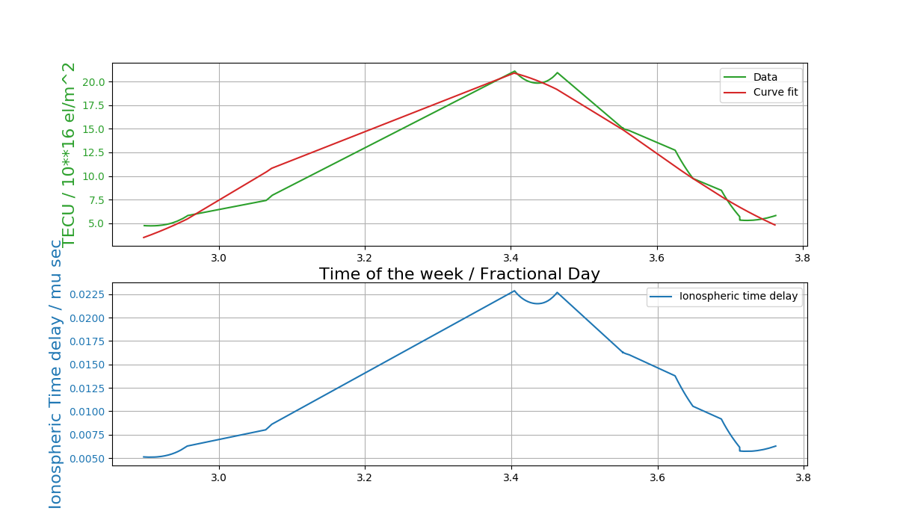

# TEC Estimation

The python package for TEC estimation using Trimble Thunderbolt E Single Frequency GPS module is written in python, with Klobuchar's algorithm for the TEC estimation. The Ionospheric delay is used to calculate the vertical total electron content.
This package requires the following modules to work
  1. numpy
  2. matplotlib
  3. TSIP (Python wrapper for the Trimble communication)
  4. mpld3

Everyday a plot of the TEC and Ionospheric delay is produced, and updated at midnight, local time. An example plot can be seen here,

Figure 1: The TEC values estimated ionospheric delay

